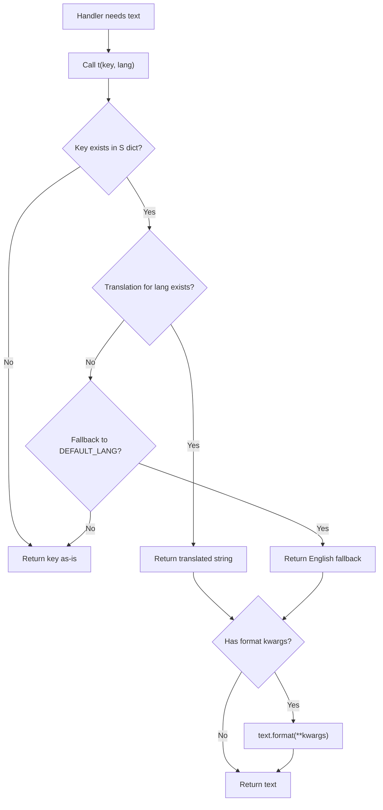
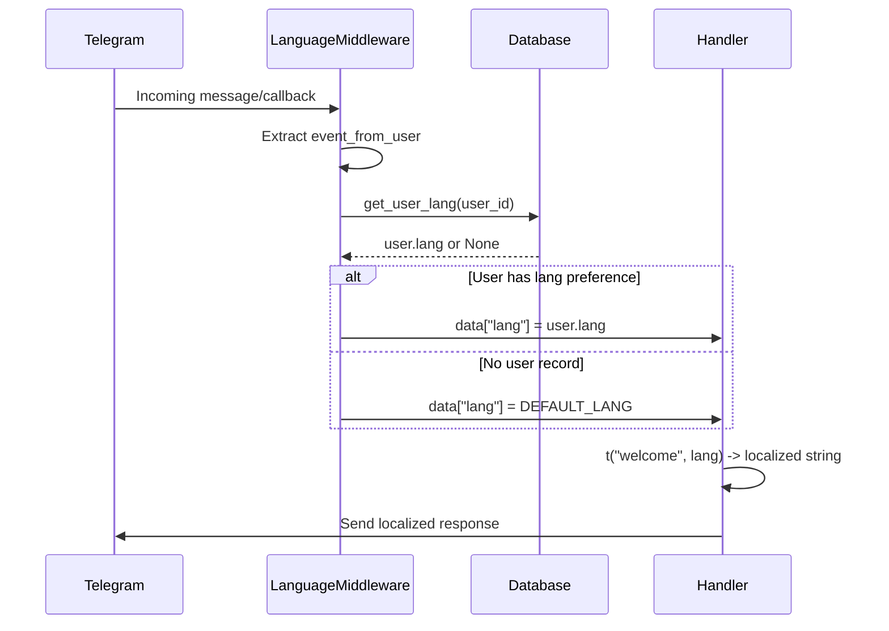
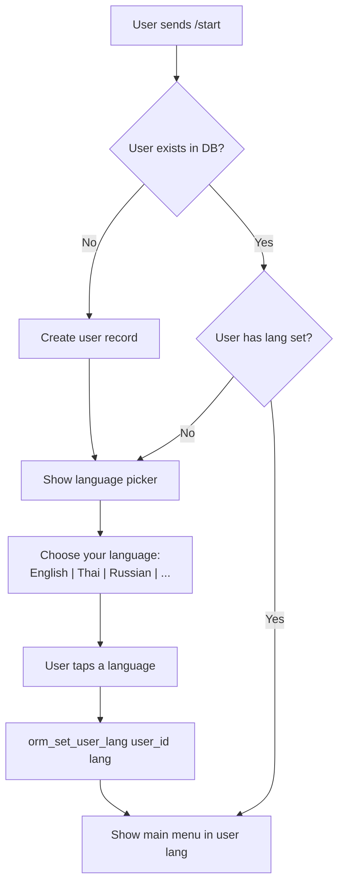
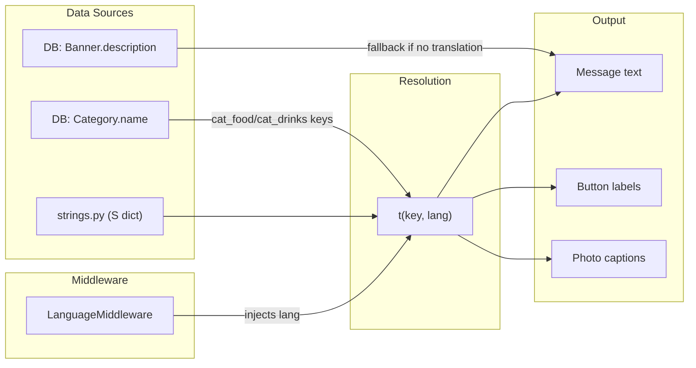

# Feature Card: Localization System

## Problem

All UI strings are currently hardcoded as bilingual inline text (`"Hello / สวัสดี"`). This doesn't scale — adding a third language means editing every string in every file. Users also can't choose their preferred language.

---

## Goal

Users select their language once (or it auto-detects from Telegram). All bot messages, buttons, and templates render in that language only.

---

## Approach Options

### Option A: Tagged templates (single file, all languages per key)

```python
# lexicon/strings.py
STRINGS = {
    "welcome": {
        "en": "Welcome!",
        "th": "ยินดีต้อนรับ!",
    },
    "cart_empty": {
        "en": "Your cart is empty!",
        "th": "ตะกร้าว่างเปล่า!",
    },
    "btn_menu": {
        "en": "Menu 🍕",
        "th": "เมนู 🍕",
    },
    # ...
}
```

**Pros:** All translations for a key are co-located — easy to spot missing translations.
**Cons:** File gets large. Harder for a Thai-only translator to work on (they see all languages).

### Option B: Separate file per language

```
lexicon/
├── en.py    # STRINGS = {"welcome": "Welcome!", "cart_empty": "Your cart is empty!", ...}
├── th.py    # STRINGS = {"welcome": "ยินดีต้อนรับ!", "cart_empty": "ตะกร้าว่างเปล่า!", ...}
```

**Pros:** Clean separation. Easy to hand off `th.py` to a Thai translator.
**Cons:** Keys can drift out of sync between files.

### Option C: aiogram's built-in i18n middleware (Fluent/gettext)

aiogram supports `I18nMiddleware` with `.ftl` (Fluent) files:

```
locales/
├── en/
│   └── messages.ftl    # welcome = Welcome!
├── th/
│   └── messages.ftl    # welcome = ยินดีต้อนรับ!
```

**Pros:** Industry standard. Supports plurals, gender, variables natively. aiogram has built-in support.
**Cons:** Extra dependency (`fluent.runtime`). More setup.

---

## Recommendation: Option A (tagged dict) + helper function

For this project's size (~30-40 strings), a single dict file is simplest. No extra dependencies, easy to maintain, and co-located translations make it obvious when a language is missing.

---

## Architecture Diagrams

### Translation resolution flow



### Language middleware pipeline



### Language selection flow



### How localized text flows through the system



---

## Proposed Design

### 1. Language strings file

```python
# lexicon/strings.py

LANGS = ["en", "th"]
DEFAULT_LANG = "en"

S = {
    # Main menu
    "welcome":       {"en": "Welcome!",              "th": "ยินดีต้อนรับ!"},
    "btn_menu":      {"en": "Menu 🍕",               "th": "เมนู 🍕"},
    "btn_cart":      {"en": "Cart 🛒",               "th": "ตะกร้า 🛒"},
    "btn_about":     {"en": "About ℹ️",              "th": "เกี่ยวกับเรา ℹ️"},
    "btn_payment":   {"en": "Payment 💰",            "th": "ชำระเงิน 💰"},
    "btn_delivery":  {"en": "Delivery ⛵",            "th": "จัดส่ง ⛵"},
    "btn_back":      {"en": "Back",                   "th": "กลับ"},
    "btn_buy":       {"en": "Buy 💵",                 "th": "ซื้อ 💵"},
    "btn_remove":    {"en": "Remove",                 "th": "ลบ"},
    "btn_home":      {"en": "Home 🏠",               "th": "หน้าหลัก 🏠"},
    "btn_order":     {"en": "Order",                  "th": "สั่งซื้อ"},

    # Info pages
    "about_text":    {"en": "Afghan Restaurant Bang Chak\nOpen daily",
                      "th": "ร้านอาหารอัฟกัน บางจาก\nเปิดทุกวัน"},
    "categories":    {"en": "Categories:",            "th": "หมวดหมู่:"},
    "cart_empty":    {"en": "Your cart is empty!",    "th": "ตะกร้าว่างเปล่า!"},

    # Product
    "price":         {"en": "Price",                  "th": "ราคา"},
    "item_of":       {"en": "Item {cur} of {total}",  "th": "สินค้า {cur} จาก {total}"},
    "added_to_cart": {"en": "Added to cart",          "th": "เพิ่มลงตะกร้าแล้ว"},
    "total":         {"en": "Total",                  "th": "รวม"},

    # Admin
    "add_product":   {"en": "Add product",            "th": "เพิ่มสินค้า"},
    "products":      {"en": "Products",               "th": "สินค้า"},
    "enter_name":    {"en": "Enter product name",     "th": "ใส่ชื่อสินค้า"},
    "enter_desc":    {"en": "Enter description",      "th": "ใส่คำอธิบาย"},
    "enter_price":   {"en": "Enter price",            "th": "ใส่ราคา"},
    "upload_image":  {"en": "Upload product image",   "th": "อัปโหลดรูปสินค้า"},
    "choose_cat":    {"en": "Choose a category",      "th": "เลือกหมวดหมู่"},
    "product_added": {"en": "Product added/updated",  "th": "เพิ่ม/อัปเดตสินค้าแล้ว"},
    "product_del":   {"en": "Product deleted",        "th": "ลบสินค้าแล้ว"},
    "cancelled":     {"en": "Cancelled",              "th": "ยกเลิกแล้ว"},

    # Language selection
    "choose_lang":   {"en": "Choose your language",   "th": "เลือกภาษา"},
}
```

### 2. Helper function

```python
# lexicon/i18n.py

from lexicon.strings import S, DEFAULT_LANG

def t(key: str, lang: str = DEFAULT_LANG, **kwargs) -> str:
    """Get translated string. Falls back to English."""
    text = S.get(key, {}).get(lang) or S.get(key, {}).get(DEFAULT_LANG, key)
    if kwargs:
        text = text.format(**kwargs)
    return text
```

### 3. Store user language preference

Add a `lang` column to the `User` model:

```python
# In database/models.py
class User(Base):
    ...
    lang: Mapped[str] = mapped_column(String(5), default="en")
```

### 4. Language selection flow

On `/start`, if user has no language set, show a language picker:

```
🌐 Choose your language / เลือกภาษา:

[English]  [ภาษาไทย]
```

Store the choice in DB. All subsequent messages use `t("key", user.lang)`.

### 5. ~~Middleware to inject language~~ — DROPPED

Originally proposed a `LanguageMiddleware` to auto-inject `lang` into every handler. **Decided against it** — it would add an extra DB query on every request even when `lang` isn't needed. Handlers already call `orm_get_user_lang()` on demand, which is simpler and avoids unnecessary overhead.

### 6. DB-seeded content (banners, categories) — SIMPLIFIED

Originally proposed storing categories/banners as multi-lang JSON dicts in the DB. **Simplified instead** — DB stores plain English names, and translations are resolved at display time via `S` dict keys (e.g. `cat_food`, `cat_drinks`). This avoids data duplication and keeps all translations in one place (`strings.py`).

---

## Files to change

| File | Change |
|------|--------|
| `lexicon/strings.py` | **NEW** — all translated strings |
| `lexicon/i18n.py` | **NEW** — `t()` helper |
| ~~`middlewares/i18n.py`~~ | ~~Dropped — handlers fetch lang on demand instead~~ |
| `database/models.py` | Add `lang` column to `User` |
| `database/orm_query.py` | Add `get_user_lang()`, `set_user_lang()` |
| `handlers/user_private.py` | Language picker on `/start`, use `t()` |
| `handlers/admin_private.py` | Use `t()` for all messages |
| `handlers/menu_processing.py` | Use `t()` for all captions/labels |
| `keyboards/inline.py` | Accept `lang` param, use `t()` for button text |
| `common/texts_for_db.py` | ~~Multi-lang dicts~~ — kept as English, resolved via `S` dict keys at display time |

---

## Adding a new language later

1. Add language code to `LANGS` in `strings.py`
2. Add translations for each key: `"welcome": {..., "km": "សូមស្វាគមន៍!"}`
3. Add a button to the language picker
4. Done — no other code changes needed

---

## Scope estimate

~10 files changed, ~3 new files. Core logic is straightforward — most of the work is extracting hardcoded strings into `S` dict keys.
