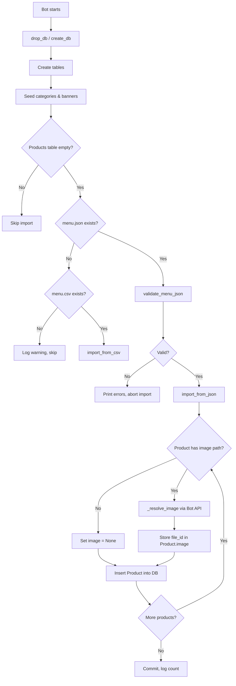
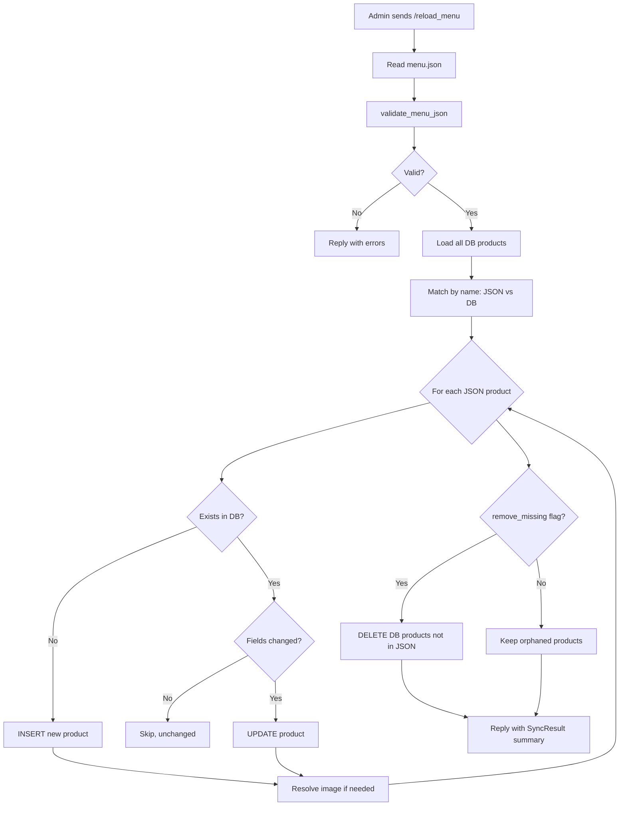
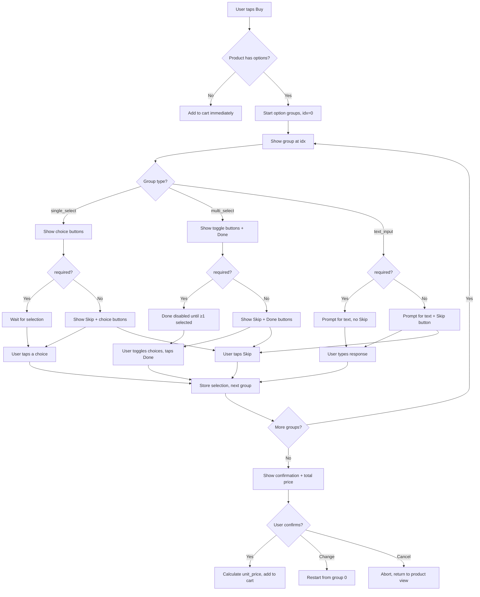
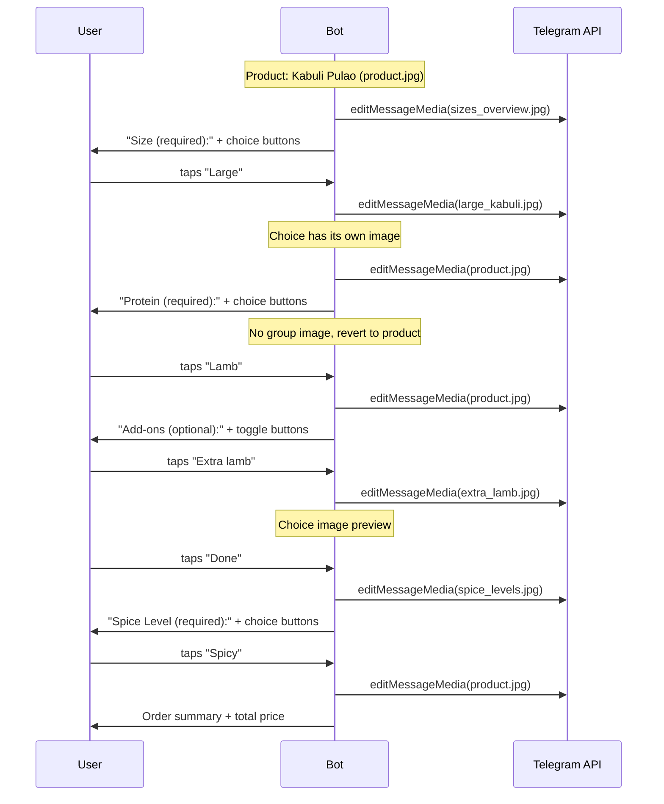
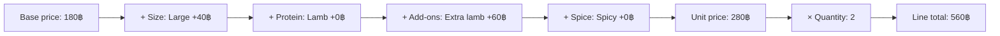

# Feature Card: Menu Loading from JSON

## Current State

The bot already has a basic JSON import pipeline:

- **`data/menu.json`** — 18 products with names, descriptions, prices, categories, and options
- **`database/menu_import.py`** — reads JSON on startup, inserts into DB if Product table is empty
- **`database/engine.py`** — calls `import_menu()` inside `create_db()`

### What works today

| Capability | Status |
|---|---|
| Load product name, description, price from JSON | Working |
| Auto-create categories from JSON | Working |
| Store `options` JSON (sizes, add-ons, spice levels) | Stored in DB, **not displayed or selectable by users** |
| Local image file paths in JSON | **Not implemented** — `image` field is always `""` |
| CSV fallback | Working (no options support) |
| Skip import if products already exist | Working |

---

## Problem

1. **Images can't be loaded from JSON.** The `image` field exists but is always empty. There is no logic to read a local file path (e.g. `"images/kabuli.jpg"`) and upload it to Telegram to get a `file_id`. Images can only be added one-by-one through the admin panel.

2. **Options are stored but invisible.** The `options` JSON (sizes, add-ons, spice levels, fillings) is saved to the database but never rendered in product views or selectable during "Add to Cart." It's dead data.

3. **No validation.** A malformed `menu.json` (missing required fields, invalid price, unknown category reference) silently produces broken products or crashes on startup.

4. **No hot-reload.** Updating `menu.json` has no effect unless you drop the entire database. There is no way to sync changes (new products, price updates, removed items) without losing all user data (carts, users).

5. **No admin re-import.** Only the startup code can trigger an import. An admin cannot reload the menu from Telegram.

---

## Goals

1. **Local image support** — resolve `image` paths from JSON (relative to `data/`) and upload them to Telegram on import, storing the resulting `file_id`.
2. **Options rendering** — display product options (sizes, add-ons, spice levels) in product views and let users select them when adding to cart.
3. **JSON schema validation** — validate `menu.json` on import and surface clear errors (which product, which field, what's wrong).
4. **Sync / diff import** — update existing products from JSON without dropping the DB. Add new products, update changed ones, optionally remove products no longer in JSON.
5. **Admin `/reload_menu` command** — let admins trigger a re-import from Telegram.

---

## Architecture Diagrams

### Startup import flow



### Admin reload / sync flow



### Option selection flow (user buying a product)



### Option image swapping during selection



### Price calculation



---

## JSON Schema (target format)

The existing format is kept, with clarifications on the `image` and `options` fields:

```json
{
  "_comment": "...",
  "categories": ["Food", "Drinks", "Desserts"],
  "products": [
    {
      "name": "Kabuli Pulao",
      "description": "Traditional Afghan rice with lamb, carrots, and raisins",
      "price": 180,
      "category": "Food",
      "image": "images/kabuli_pulao.jpg",
      "options": {
        "sizes": [
          {"name": "Regular", "price_modifier": 0},
          {"name": "Large", "price_modifier": 40}
        ],
        "add_ons": [
          {"name": "Extra lamb", "price": 60},
          {"name": "Extra raisins", "price": 20}
        ],
        "spice_level": ["Mild", "Medium", "Spicy"]
      }
    }
  ]
}
```

### Field rules

| Field | Required | Type | Notes |
|---|---|---|---|
| `name` | Yes | string, 1-150 chars | Must be unique within the JSON file |
| `description` | Yes | string, 1+ chars | |
| `price` | Yes | number, > 0 | Base price before options |
| `category` | Yes | string | Must match a value in the `categories` array |
| `image` | No | string | Relative path from `data/` dir (e.g. `"images/kabuli.jpg"`), absolute path, URL, or `""` for no image |
| `options` | No | object or null | Structured options (see below) |

### Options schema

Options are defined as an **array of option groups**. Each group is a named set of choices the customer can pick from. This replaces the old implicit key-based format with a unified, explicit structure.

```json
{
  "options": [
    {
      "group_name": "Size",
      "type": "single_select",
      "required": true,
      "image": "",
      "choices": [
        {"name": "Regular", "price_modifier": 0, "image": ""},
        {"name": "Large",   "price_modifier": 40, "image": "images/options/large_kabuli.jpg"}
      ]
    },
    {
      "group_name": "Add-ons",
      "type": "multi_select",
      "required": false,
      "image": "",
      "choices": [
        {"name": "Extra lamb",    "price_modifier": 60, "image": "images/options/extra_lamb.jpg"},
        {"name": "Extra raisins", "price_modifier": 20, "image": ""}
      ]
    },
    {
      "group_name": "Spice Level",
      "type": "single_select",
      "required": true,
      "image": "",
      "choices": [
        {"name": "Mild",   "price_modifier": 0, "image": ""},
        {"name": "Medium", "price_modifier": 0, "image": ""},
        {"name": "Spicy",  "price_modifier": 0, "image": ""}
      ]
    },
    {
      "group_name": "Special Instructions",
      "type": "text_input",
      "required": false,
      "image": "",
      "placeholder": "e.g. no onions, extra sauce..."
    }
  ]
}
```

### Option group fields

| Field | Required | Type | Description |
|---|---|---|---|
| `group_name` | Yes | string | Display name shown to the user (e.g. "Size", "Spice Level") |
| `type` | Yes | enum | One of: `single_select`, `multi_select`, `text_input` |
| `required` | Yes | bool | If `true`, user **must** make a selection before adding to cart. If `false`, group can be skipped |
| `image` | No | string | Image for the option group header (shown when presenting this group). Same path rules as product `image` |
| `choices` | Yes* | array | List of choice objects. *Required for `single_select` and `multi_select`, omitted for `text_input` |
| `placeholder` | No | string | Hint text for `text_input` type. Ignored for other types |

### Choice fields

| Field | Required | Type | Description |
|---|---|---|---|
| `name` | Yes | string | Display name of the choice (e.g. "Large", "Extra lamb") |
| `price_modifier` | Yes | number | Price adjustment. `0` = no change, `40` = adds 40 to base price, `-10` = discount. Applied additively |
| `image` | No | string | Image for this specific choice. When provided, the bot sends/updates the photo when the user hovers over or selects this choice. Same path rules as product `image` |

### Option types explained

#### `single_select` — pick exactly one

User must (or may, if `required: false`) choose **one** value from the list. Selecting a different value replaces the previous selection.

**Use for:** Size, spice level, filling, protein, sweetness.

**UI:** Inline keyboard with one button per choice. Tapping a choice highlights it (checkmark) and moves to the next group.

```
Choose Size (required):
[Regular] [Large (+40฿)]
```

If `required: false`, an additional **[Skip]** button is shown.

#### `multi_select` — pick zero or more

User can toggle **multiple** choices on/off. A **[Done]** button confirms the selection and moves to the next group.

**Use for:** Add-ons, toppings, extras.

**UI:** Inline keyboard with toggle buttons. Selected items show a checkmark. Price modifiers are shown inline.

```
Add-ons (optional):
[✅ Extra lamb (+60฿)] [Extra raisins (+20฿)]
[Done]
```

If `required: true`, at least one choice must be selected before **[Done]** is enabled.

#### `text_input` — free text

User types a text response. No choices array.

**Use for:** Special instructions, custom requests, allergy notes.

**UI:** Bot sends a message with the `placeholder` text. User replies with text. If `required: false`, a **[Skip]** button is shown as an inline keyboard.

```
Special Instructions (optional):
Type your request or tap Skip.
[Skip]
```

### Option images — how they work

Images can be attached at two levels:

1. **Group-level image** (`option_group.image`) — shown once when the bot presents this option group to the user. Useful for showing a visual overview (e.g., a photo showing all available sizes side by side).

2. **Choice-level image** (`choice.image`) — shown when the user selects or previews a specific choice. The bot edits the message media to show the choice's image, then reverts to the product image (or group image) when moving on.

**Behavior:**
- If a choice has an `image`, tapping it updates the photo in the message to show that image.
- If a choice has no `image`, the current photo stays unchanged.
- When the user moves to the next option group, the photo resets to the next group's image (if any) or the product image.
- Images use the same resolution rules as product images: relative path from `data/`, absolute path, URL, or empty string for none.

**File structure example:**

```
data/
  menu.json
  images/
    kabuli_pulao.jpg
    mantu.jpg
    options/
      large_kabuli.jpg
      extra_lamb.jpg
      spice_levels.jpg
```

### Price calculation

Final price = `base_price` + sum of all selected `price_modifier` values across all option groups.

```
Kabuli Pulao         180฿  (base)
  + Large             +40฿  (size modifier)
  + Extra lamb        +60฿  (add-on modifier)
  + Spicy              +0฿  (no modifier)
  ─────────────────────────
  Total:              280฿
```

### Backward compatibility with old format

The old implicit format (bare keys with string arrays or `{name, price}` objects) is still accepted during a transition period. The importer detects the old format and converts it:

| Old format | Converted to |
|---|---|
| `"spice_level": ["Mild", "Medium"]` | `{"group_name": "Spice Level", "type": "single_select", "required": false, "choices": [{"name": "Mild", "price_modifier": 0}, ...]}` |
| `"sizes": [{"name": "Regular", "price_modifier": 0}]` | `{"group_name": "Size", "type": "single_select", "required": true, "choices": [...]}` |
| `"add_ons": [{"name": "Extra lamb", "price": 60}]` | `{"group_name": "Add-ons", "type": "multi_select", "required": false, "choices": [{"name": "Extra lamb", "price_modifier": 60}, ...]}` |

The `price` key in old add-ons is remapped to `price_modifier`. Old-format options get `required: false` by default (except `sizes` which defaults to `required: true`). No images are set during conversion.

A startup warning is logged when old format is detected:
```
WARNING: menu.json uses legacy options format for "Kabuli Pulao". Migrate to the new array-of-groups format.
```

### Full product example with all option types

```json
{
  "name": "Kabuli Pulao",
  "description": "Traditional Afghan rice with lamb, carrots, and raisins",
  "price": 180,
  "category": "Food",
  "image": "images/kabuli_pulao.jpg",
  "options": [
    {
      "group_name": "Size",
      "type": "single_select",
      "required": true,
      "image": "images/options/sizes_overview.jpg",
      "choices": [
        {"name": "Regular", "price_modifier": 0, "image": ""},
        {"name": "Large",   "price_modifier": 40, "image": "images/options/large_kabuli.jpg"},
        {"name": "Family",  "price_modifier": 120, "image": "images/options/family_kabuli.jpg"}
      ]
    },
    {
      "group_name": "Protein",
      "type": "single_select",
      "required": true,
      "image": "",
      "choices": [
        {"name": "Lamb",    "price_modifier": 0,  "image": ""},
        {"name": "Chicken", "price_modifier": -20, "image": ""}
      ]
    },
    {
      "group_name": "Add-ons",
      "type": "multi_select",
      "required": false,
      "image": "",
      "choices": [
        {"name": "Extra lamb",    "price_modifier": 60, "image": "images/options/extra_lamb.jpg"},
        {"name": "Extra raisins", "price_modifier": 20, "image": ""},
        {"name": "Yogurt side",   "price_modifier": 25, "image": "images/options/yogurt.jpg"}
      ]
    },
    {
      "group_name": "Spice Level",
      "type": "single_select",
      "required": true,
      "image": "images/options/spice_levels.jpg",
      "choices": [
        {"name": "Mild",   "price_modifier": 0, "image": ""},
        {"name": "Medium", "price_modifier": 0, "image": ""},
        {"name": "Spicy",  "price_modifier": 0, "image": ""},
        {"name": "Extra Hot", "price_modifier": 0, "image": ""}
      ]
    },
    {
      "group_name": "Special Instructions",
      "type": "text_input",
      "required": false,
      "image": "",
      "placeholder": "e.g. no onions, extra sauce, allergy info..."
    }
  ]
}
```

### Validation rules for options

| Rule | Error message |
|---|---|
| `group_name` missing or empty | `"Option group #{i} is missing 'group_name'"` |
| `type` not one of `single_select`, `multi_select`, `text_input` | `"Option group '{name}' has invalid type '{type}'"` |
| `required` missing | `"Option group '{name}' is missing 'required' (must be true or false)"` |
| `choices` missing for `single_select` / `multi_select` | `"Option group '{name}' requires a 'choices' array"` |
| `choices` is empty array | `"Option group '{name}' has no choices"` |
| Choice missing `name` | `"Choice #{j} in '{group_name}' is missing 'name'"` |
| Choice missing `price_modifier` | `"Choice #{j} in '{group_name}' is missing 'price_modifier'"` |
| `price_modifier` not a number | `"Choice '{name}' in '{group_name}' has invalid price_modifier"` |
| Duplicate `group_name` within same product | `"Duplicate option group '{name}'"` |
| Duplicate choice `name` within same group | `"Duplicate choice '{name}' in group '{group_name}'"` |
| `image` path provided but file not found | Warning (non-fatal): `"Image not found for choice '{name}' in '{group_name}': {path}"` |

---

## Implementation Plan

### Phase 1: Image loading from local files

**Goal:** When `image` is a file path in `menu.json`, upload it to Telegram and store the `file_id`.

#### Changes to `menu_import.py`

```python
from aiogram import Bot
from pathlib import Path

async def _resolve_image(bot: Bot, image_value: str, data_dir: Path) -> str | None:
    """
    Resolve an image field from menu.json to a Telegram file_id.

    Accepts:
      - "" or None         -> None (no image)
      - Local relative path -> upload to Telegram, return file_id
      - Local absolute path -> upload to Telegram, return file_id
      - URL (http/https)   -> pass to Telegram as URL, return file_id
    """
    if not image_value:
        return None

    # Check if it's a URL
    if image_value.startswith(("http://", "https://")):
        msg = await bot.send_photo(
            chat_id=bot.id,  # send to self / use a dedicated channel
            photo=image_value,
        )
        return msg.photo[-1].file_id

    # Resolve local file path
    path = Path(image_value)
    if not path.is_absolute():
        path = data_dir / image_value

    if not path.exists():
        print(f"WARNING: Image not found: {path}")
        return None

    from aiogram.types import FSInputFile
    photo = FSInputFile(path)
    msg = await bot.send_photo(chat_id=..., photo=photo)
    return msg.photo[-1].file_id
```

**Challenge:** Uploading to Telegram requires sending the photo somewhere. Options:
- **Option A:** Send to a dedicated "media dump" channel/chat (configured via env var `MEDIA_CHAT_ID`). Best option — keeps uploads out of user chats. The message can be deleted after extracting the `file_id`.
- **Option B:** Use `bot.send_photo` to the bot's own saved messages. Simpler but less clean.

**Recommendation:** Option A with `MEDIA_CHAT_ID` env var. If not configured, skip image upload and log a warning.

#### File structure for images

```
telegrambot/
  data/
    menu.json
    images/
      kabuli_pulao.jpg
      mantu.jpg
      ...
```

#### Signature change

`import_menu()` and `import_from_json()` need a `bot: Bot` parameter:

```python
async def import_menu(session: AsyncSession, bot: Bot) -> int:
```

Update `engine.py` → `create_db()` to accept and pass `bot`.

---

### Phase 2: JSON validation

**Goal:** Validate `menu.json` before importing and give clear error messages.

#### New file: `database/menu_validator.py`

```python
@dataclass
class ValidationError:
    product_index: int | None  # None for top-level errors
    product_name: str | None
    field: str
    message: str

def validate_menu_json(data: dict) -> list[ValidationError]:
    """Validate menu JSON structure. Returns list of errors (empty = valid)."""
    errors = []

    # Top-level checks
    if "products" not in data:
        errors.append(ValidationError(None, None, "products", "Missing 'products' array"))
        return errors

    categories = set(data.get("categories", []))
    seen_names = set()

    for i, item in enumerate(data["products"]):
        name = item.get("name", f"<product #{i}>")

        # Required fields
        for field in ("name", "description", "price", "category"):
            if field not in item:
                errors.append(ValidationError(i, name, field, f"Missing required field '{field}'"))

        # Type checks
        if "price" in item:
            try:
                p = float(item["price"])
                if p <= 0:
                    errors.append(ValidationError(i, name, "price", "Price must be > 0"))
            except (TypeError, ValueError):
                errors.append(ValidationError(i, name, "price", f"Invalid price: {item['price']}"))

        # Category exists
        if "category" in item and categories and item["category"] not in categories:
            errors.append(ValidationError(i, name, "category",
                f"Category '{item['category']}' not in categories list"))

        # Duplicate names
        if name in seen_names:
            errors.append(ValidationError(i, name, "name", "Duplicate product name"))
        seen_names.add(name)

        # Options structure
        if item.get("options"):
            errors.extend(_validate_options(i, name, item["options"]))

    return errors
```

Import calls `validate_menu_json()` first. If errors, print them all and skip import (don't partially import).

---

### Phase 3: Options rendering & selection

**Goal:** Show options in product view and let users pick/skip them when adding to cart. Respect `required` flag, show option images, and handle all three option types.

#### Display in product view (`menu_processing.py`)

When showing a product at level 2, append a summary of available options to the caption:

```
Kabuli Pulao
Traditional Afghan rice with lamb, carrots, and raisins
Price: from 180฿

Options:
  Size (required): Regular | Large (+40฿) | Family (+120฿)
  Protein (required): Lamb | Chicken (-20฿)
  Add-ons: Extra lamb (+60฿) | Extra raisins (+20฿) | Yogurt side (+25฿)
  Spice Level (required): Mild | Medium | Spicy | Extra Hot
  Special Instructions: free text
```

Show "from X฿" instead of "X฿" when the product has price-affecting options.

#### Selection flow

When user taps **Buy**, if the product has options:

1. Bot walks through option groups **in array order** (the JSON array order defines the presentation sequence)
2. For each group:
   - Show the group name as a header, with "(required)" or "(optional)" label
   - If the group has an `image`, update the message photo to that image
   - Render the appropriate UI based on `type` (see below)
3. After all groups are done (or skipped), show a confirmation summary with calculated price
4. User confirms → add to cart

**Step-by-step example:**

```
[Photo: sizes_overview.jpg]
Size (required):
[Regular (180฿)] [Large (+40฿)] [Family (+120฿)]

  → User taps "Large"

[Photo: kabuli_pulao.jpg (reverts to product image)]
Protein (required):
[Lamb] [Chicken (-20฿)]

  → User taps "Lamb"

[Photo: kabuli_pulao.jpg]
Add-ons (optional):
[Extra lamb (+60฿)] [Extra raisins (+20฿)] [Yogurt side (+25฿)]
[Skip] [Done]

  → User taps "Extra lamb" (toggles ✅), taps "Done"

[Photo: spice_levels.jpg]
Spice Level (required):
[Mild] [Medium] [Spicy] [Extra Hot]

  → User taps "Spicy"

[Photo: kabuli_pulao.jpg]
Special Instructions (optional):
Type your request or tap Skip.
[Skip]

  → User taps "Skip"

[Photo: kabuli_pulao.jpg]
Your order:
  Kabuli Pulao
  Size: Large (+40฿)
  Protein: Lamb
  Add-ons: Extra lamb (+60฿)
  Spice: Spicy
  Total: 280฿
[✅ Add to Cart] [✏️ Change] [❌ Cancel]
```

#### Handling `required` vs optional groups

| `required` | `type` | Behavior |
|---|---|---|
| `true` | `single_select` | No Skip button. User must pick one choice to proceed |
| `false` | `single_select` | Skip button shown. User can skip (no selection stored) |
| `true` | `multi_select` | Done button disabled until at least one choice is toggled. No Skip button |
| `false` | `multi_select` | Skip and Done both shown. Skip = no selections. Done = confirm current toggles |
| `true` | `text_input` | User must type something. No Skip button. A Cancel button exits the whole flow |
| `false` | `text_input` | Skip button shown. User can skip or type a response |

#### Handling option images

When presenting an option group or choice that has an `image`:

```python
async def _show_option_group(message, product, group, current_photo_file_id):
    """Show an option group, updating the photo if the group has an image."""
    photo = group.get("image") or product.image or PLACEHOLDER
    if photo != current_photo_file_id:
        # Edit message media to show group/choice image
        await message.edit_media(InputMediaPhoto(media=photo, caption=caption))
    else:
        await message.edit_caption(caption=caption)
```

When a user taps a choice that has its own `image`:
- Temporarily swap the message photo to that choice's image
- When user moves to next group or confirms, revert to the next relevant image

This gives users a visual preview of what they're selecting (e.g., seeing what "Family size" looks like).

#### Cart model change

The `Cart` model needs to store selected options and computed unit price:

```python
class Cart(Base):
    # ... existing fields ...
    selected_options: Mapped[dict | None] = mapped_column(JSON, nullable=True)
    # Stores the user's selections per group:
    # {
    #   "Size": {"choice": "Large", "price_modifier": 40},
    #   "Protein": {"choice": "Lamb", "price_modifier": 0},
    #   "Add-ons": {"choices": ["Extra lamb"], "price_modifier": 60},
    #   "Spice Level": {"choice": "Spicy", "price_modifier": 0},
    #   "Special Instructions": {"text": "no onions"}
    # }
    unit_price: Mapped[float] = mapped_column(Numeric(7, 2), nullable=True)
    # calculated: base_price + sum of all price_modifiers
```

#### Callback data for option selection

```python
class OptionCallBack(CallbackData, prefix="opt"):
    product_id: int
    group_idx: int      # index in the options array (0, 1, 2...)
    choice_idx: int     # index in choices array (-1 for skip/done/text actions)
    action: str         # "select", "toggle", "skip", "done", "confirm", "cancel", "change"
```

Using indices instead of names keeps callback data compact (Telegram has a 64-byte limit on callback data).

#### FSM for text_input options

```python
class OptionTextInput(StatesGroup):
    waiting_text = State()  # waiting for user to type free text for a text_input group
```

FSM data stores `product_id`, `group_idx`, and selections made so far, so the flow can resume after receiving the text message.

---

### Phase 4: Sync import (diff-based)

**Goal:** Update products from JSON without dropping the DB.

#### Strategy: match by `name`

Product `name` is the unique key for matching JSON items to DB rows.

```python
async def sync_menu(session: AsyncSession, bot: Bot, remove_missing: bool = False) -> SyncResult:
    """
    Sync database products with menu.json.

    - New products in JSON → insert
    - Changed products (price, description, options, image) → update
    - Products in DB but not in JSON → delete only if remove_missing=True
    """
```

Returns a `SyncResult` with counts:

```python
@dataclass
class SyncResult:
    added: int
    updated: int
    removed: int
    unchanged: int
    errors: list[str]
```

#### Change detection

Compare each JSON product against its DB counterpart:

```python
def _product_changed(db_product: Product, json_item: dict) -> bool:
    return (
        db_product.description != json_item["description"]
        or float(db_product.price) != float(json_item["price"])
        or db_product.options != json_item.get("options")
        # image changes only if json has a non-empty value different from current
    )
```

---

### Phase 5: Admin `/reload_menu` command

**Goal:** Admin can trigger a menu sync from Telegram.

#### Handler in `admin_private.py`

```python
@admin_router.message(Command("reload_menu"), IsAdmin())
async def reload_menu(message: Message, session: AsyncSession, bot: Bot):
    await message.answer("Reloading menu from menu.json...")

    result = await sync_menu(session, bot, remove_missing=False)

    await message.answer(
        f"Menu sync complete:\n"
        f"  Added: {result.added}\n"
        f"  Updated: {result.updated}\n"
        f"  Unchanged: {result.unchanged}\n"
        f"  Errors: {len(result.errors)}"
    )
```

Optional flag: `/reload_menu --purge` to also remove products not in JSON.

---

## Files to Change

| File | Change |
|---|---|
| `database/menu_import.py` | Add `bot` param, image resolution, call validator, sync logic |
| `database/menu_validator.py` | **New** — JSON schema validation |
| `database/engine.py` | Pass `bot` to `import_menu()` |
| `database/models.py` | Add `selected_options` and `unit_price` to `Cart` |
| `handlers/menu_processing.py` | Render options in product caption |
| `handlers/user_private.py` | Option selection flow when adding to cart |
| `handlers/admin_private.py` | Add `/reload_menu` command |
| `keyboards/inline.py` | Add `OptionCallBack`, option selection keyboard builders |
| `data/menu.json` | Add image paths once image files are placed |
| `data/images/` | **New dir** — product images |
| `main.py` | Pass `bot` to `create_db()` |
| `.env` / config | Add `MEDIA_CHAT_ID` for image uploads |

---

## Implementation Order

| Phase | Depends on | Effort |
|---|---|---|
| **Phase 2: Validation** | Nothing | Small — do first, immediate safety benefit |
| **Phase 1: Image loading** | Phase 2 (validate before upload) | Medium — Telegram upload logic + env config |
| **Phase 4: Sync import** | Phase 2 | Medium — diff logic, name-based matching |
| **Phase 5: Admin reload** | Phase 4 | Small — just a handler calling sync |
| **Phase 3: Options rendering** | Nothing (independent) | Large — UI flow, cart model change, price calc |

**Recommended start:** Phase 2 → Phase 1 → Phase 4 → Phase 5 → Phase 3

---

## Scope Boundaries

- **No external menu APIs** — JSON file only, no integrations with POS systems or third-party menu services.
- **No image optimization** — images are uploaded as-is. Compression/resizing is out of scope.
- **No option dependencies** — e.g., "Large size only available with Chicken protein" is not supported. All options are independent.
- **No per-option inventory** — no tracking of whether "Extra lamb" is in stock.
- **No menu scheduling** — e.g., "breakfast menu 6-11am" is not supported.
